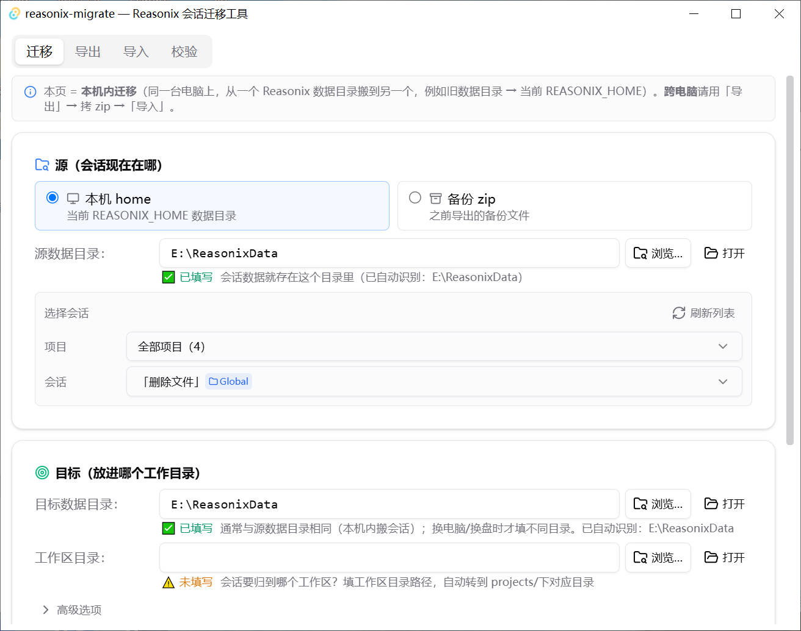
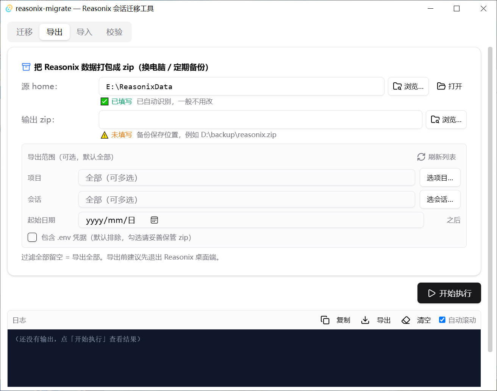
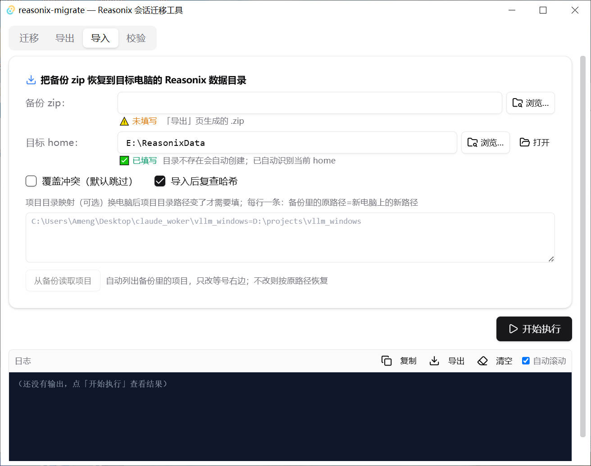
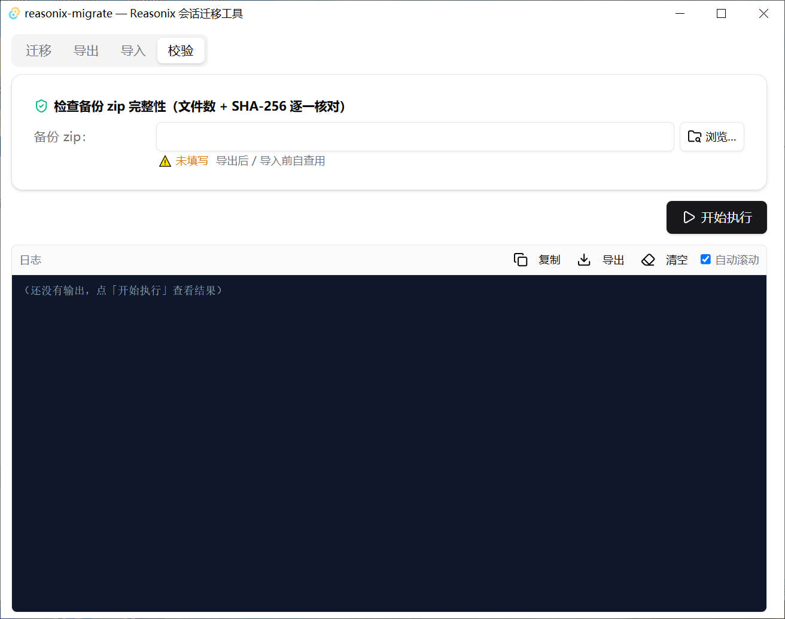

<div align="center">

# Reasonix 会话迁移工具

**Reasonix 桌面应用的会话 / 记忆 / 配置无损迁移工具。**

[](https://github.com/Amengclass/reasonix-migrate/releases)
[](https://github.com/Amengclass/reasonix-migrate)
[](LICENSE)
[](#)
[](#)
[](#)

[English](README_EN.md) | 中文 | [更新日志](CHANGELOG.md)

</div>

一款桌面 GUI 工具（Tauri 2 + React），帮你把 **Reasonix** 的数据在电脑之间、工作区之间迁移——可以单条会话迁移，也可以整机打包备份。

## ✨ 特性

- **无损设计**——只做**目录级复制**，绝不改动会话内部格式（jsonl 事件流、revision 链、content digest）。JSON 转换必然有损，目录搬运才是无损。
- **单会话迁移**——挑一个会话，放进任意目标工作区。工具自动算项目 slug、修正 meta 归属、并**自动注册项目**到 `desktop-projects.json`，Reasonix 里立即可见。
- **整机备份**——把整个 Reasonix 数据目录打包成 zip，换电脑再恢复。可选按项目 / 会话 / 日期过滤，`.env` 默认排除。
- **完整性校验**——每个备份自带 SHA-256 manifest；导入前可校验 zip，导入时复查哈希。
- **与 Reasonix 左侧列表一致**——会话列表按 `desktop-projects.json` 注册表过滤，只显示 Reasonix 真正可见的会话（不显示孤儿 recovery 分支、已删除会话）。

## 架构

```
 ┌─────────────────┐  扫描/选择  ┌──────────────────┐   复制   ┌──────────────────┐
 │ Reasonix 数据目录 │ ──────────▶ │  reasonix-migrate │ ────────▶ │ 目标工作区        │
 │  (REASONIX_HOME) │            │      (GUI)       │          │ (projects/<slug>)│
 └─────────────────┘            └──────────────────┘          └──────────────────┘
                                        │  导出 / 导入
                                        ▼
                                 ┌──────────────┐
                                 │ 备份 backup.zip │
                                 └──────────────┘
```

## 快速开始

> 需要 [Node.js](https://nodejs.org) + [pnpm](https://pnpm.io) 和 [Rust 工具链](https://rustup.rs)。

```bash
# 1. 克隆
git clone https://github.com/Amengclass/reasonix-migrate.git
cd reasonix-migrate/reasonix-migrate-tauri

# 2. 安装前端依赖
pnpm install

# 3. 构建（前端 → dist，再 Rust → 自包含 exe）
pnpm build:renderer
cd src-tauri && cargo build --features custom-protocol

# 4. 运行
./src-tauri/target/debug/reasonix-migrate-tauri.exe
```

界面有四个页签：

| 页签 | 作用 |
|---|---|
| **迁移** | 从 Reasonix home / 备份 zip / sessions 目录复制一条会话到目标工作区（自动 slug + 修 meta + 注册项目）。 |
| **导出** | 把 Reasonix 数据目录打包成备份 zip，可过滤项目 / 会话 / 日期。 |
| **导入** | 把备份 zip 恢复到目标 Reasonix home（slug 重映射、冲突跳过、哈希复查）。 |
| **校验** | 检查备份 zip 完整性（文件数 + 逐文件 SHA-256）。 |

### 界面截图

**迁移页签** — 从源 Reasonix home 选择会话，迁移到目标工作区：



**导出页签** — 把 Reasonix 数据打包成备份 zip（可按项目/会话/日期过滤）：



**导入页签** — 从备份 zip 恢复到目标 Reasonix home：



**校验页签** — 检查备份 zip 完整性（文件数 + SHA-256 哈希）：



## 兼容性

本工具基于并测试于 **Reasonix 桌面版 v1.24.1 / v1.24.2**（当前验证版本 **v1.24.2**）。Reasonix 采用版本化数据目录（`versions/<版本>/`）；本工具读取标准的 `desktop-projects.json` + `projects/*/sessions` 结构，并支持 v1.24 起引入的**双 hex recovery 分支命名**（`-recovery-<hex>-<hex>`）与 **v4 会话目录**（`cache/session-catalog/v4.sqlite`）。**数据格式差异较大的早期 Reasonix 版本可能无法使用。**

## 配置

| 变量 | 默认值 | 说明 |
|---|---|---|
| `REASONIX_HOME` | *（自动探测）* | Reasonix 数据目录路径（`desktop-projects.json`、`projects/*/sessions` 在这里）。 |

## FAQ

<details>
<summary>迁移是移动还是复制？</summary>

默认是**复制**——源会话原样保留。勾选「迁移后删除源会话」才是真正搬走（不可逆）。

</details>

<details>
<summary>为什么列表不显示磁盘上的全部会话？</summary>

列表按 `desktop-projects.json` 注册表过滤——这正是 Reasonix 左侧列表的驱动来源。孤儿 recovery 分支和已删除会话会被隐藏。

</details>

<details>
<summary>导出前要退出 Reasonix 桌面端吗？</summary>

建议退出。桌面端会持续写它的数据目录；先退出能得到完整快照。

</details>

<details>
<summary>迁移会影响会话历史吗？</summary>

不会——活跃会话（当前版本）完整保留。历史 recovery 分支原样保留，本工具不改动它们。

</details>

## 开发

```bash
pnpm install
pnpm typecheck          # TS 类型检查

pnpm build:renderer     # 前端 → dist/
cd src-tauri
cargo build --features custom-protocol   # Rust → 自包含 debug exe
```

> **注意**：启用 `custom-protocol` 时，前端是在编译时嵌入 exe 的。改了前端代码必须**重新 `cargo build`**（不能只 `build:renderer`），否则 exe 跑的还是旧界面。
> Windows 上遇到火绒/杀软文件锁（`LNK1105`）时，用附带的脚本：`.\build.ps1 debug`（开发）或 `.\tauri-build.ps1`（发布）。

## 项目结构

```text
reasonix-migrate/
├── reasonix-migrate-tauri/       # Tauri 应用
│   ├── src/                      # React 前端（迁移 / 导出 / 导入 / 校验 四页签）
│   └── src-tauri/
│       ├── src/core/             # Rust 核心：common / catalog / export / import / one
│       └── src/lib.rs            # Tauri commands
├── .gitignore
├── CHANGELOG.md
└── LICENSE
```

## 参与贡献

欢迎 PR！Bug 或功能建议请开 [issue](https://github.com/Amengclass/reasonix-migrate/issues)。改动请保持聚焦——本工具的设计原则是**目录级、无损**，不要加会改写会话内部格式的逻辑。

## 许可证

[MIT](LICENSE)
